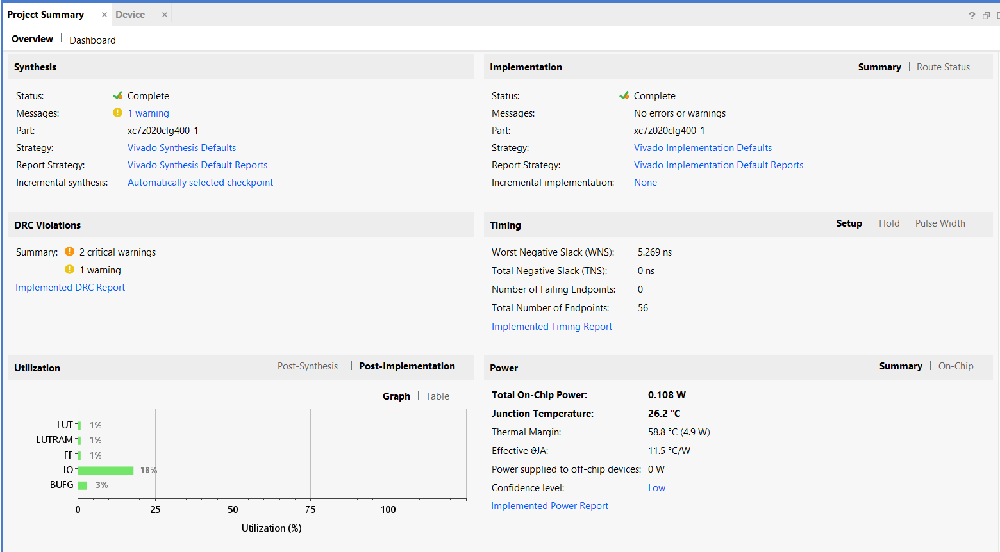
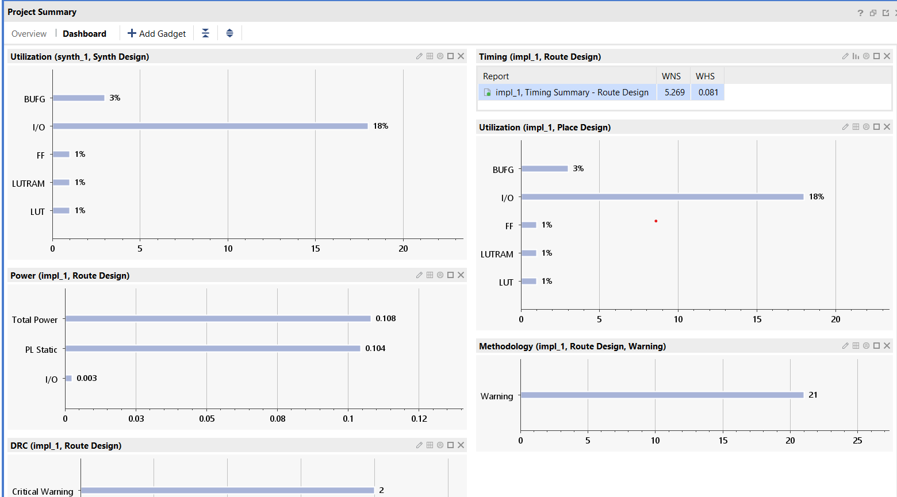
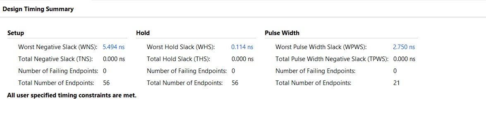
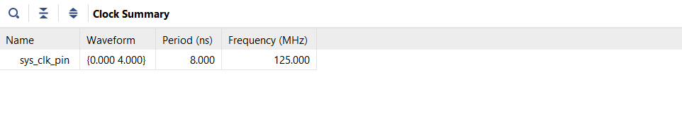
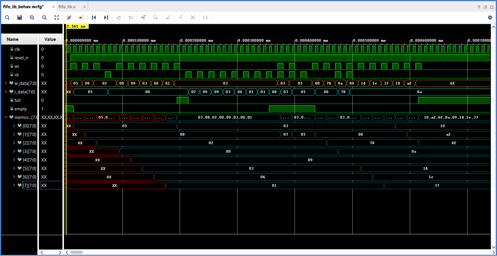

# FIFO_Buffer_HDL

# CONCEPT

* FIFO
> * First in first out
> 
>
> * Configuration
> 
>

* FIFO Circular Queue Implementation
> * Initial (empty)
>   
>
> * Write
> 
> 
>
> * Read
> 
>
> * Full & Empty
> 
>
> ``` 
> Difference between full and empty:
>   ├── Case 1(Only Read): If r_ptr_next == w_ptr => positive empty signal
>   └── Case 2(Only Write) If W_ptr_next == r_ptr => positive full signal
>   └── Case 3(Read & Write) 
>            if (positive empty) {
>                w_ptr_next = w_ptr;
>                r_ptr_next = r_ptr;}
>            else {
>                w_ptr_next = w_ptr + 1;
>                r_ptr_next = r_ptr + 1;
>            }
> ```

* FIFO HDL Implementation
> * Hierarchy module: 
> ``` 
> fifo_unit.v  
>   ├── fifo_ctrl.v  
>   └── register_file.v  
> ```

    
>
> * Block diagram
> 
>

# PERFORMANCE
* Project Summary
> 
>
> 
>
* Timing
> 
>
> 

# SIMULATION

> 